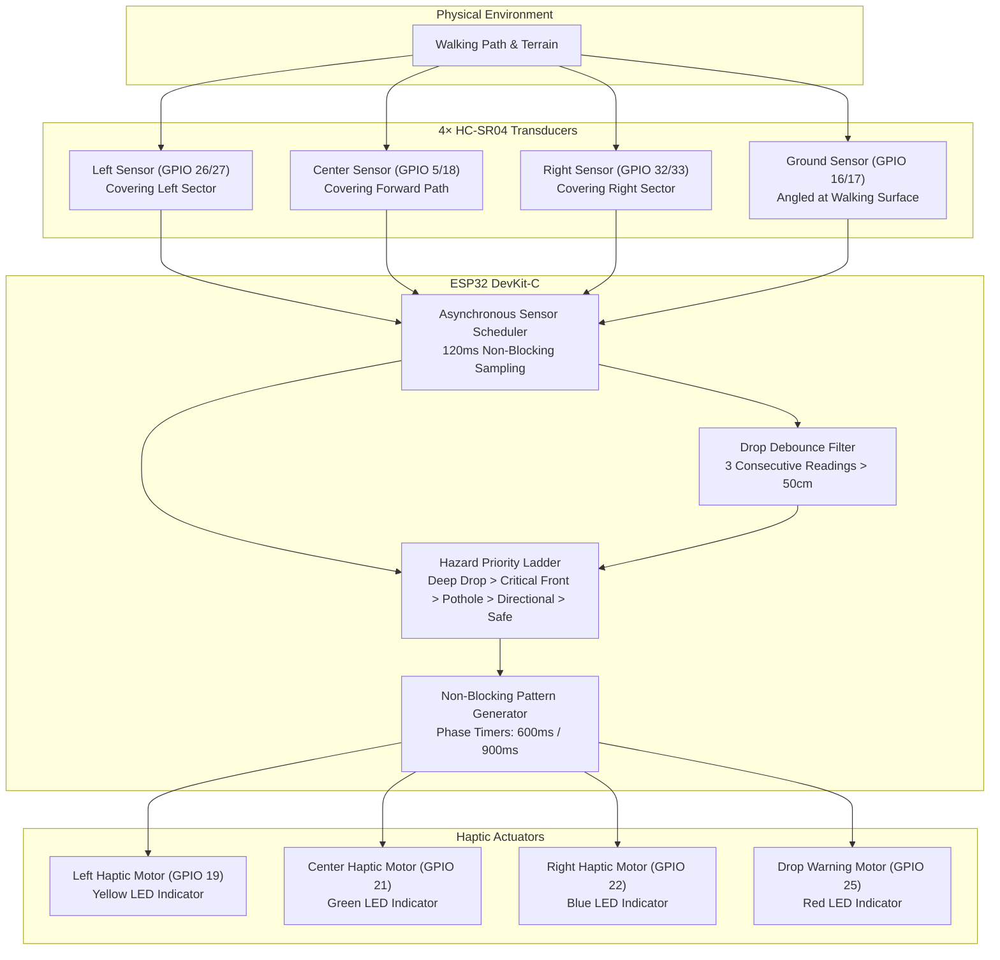
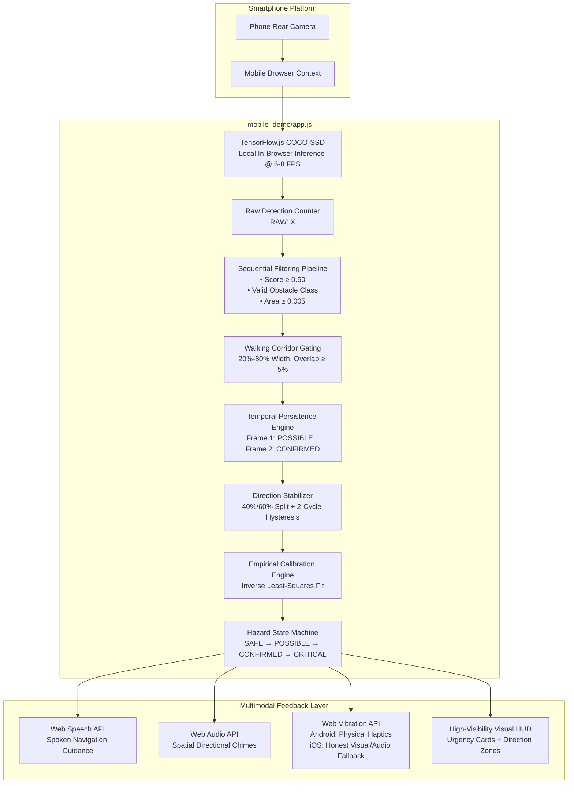

# SenseStep

**Intelligent Haptic Navigation & Hazard Awareness System**

[](#hackathon-context)
[](https://www.espressif.com/)
[](https://www.arduino.cc/)
[](https://wokwi.com/)
[](https://www.tensorflow.org/js)
[](https://developer.mozilla.org/en-US/docs/Web/API/Web_Speech_API)
[](#verification--build-status)

SenseStep is an assistive navigation framework designed to detect physical obstacles and ground hazards, determine their spatial direction, evaluate proximity, classify threat severity, and deliver intuitive, non-visual guidance through localized haptic feedback and natural spoken instructions.

Built for the **Healthcare & Safety** track, the project bridges embedded systems and client-side computer vision through two complementary implementations:

1. **Production Embedded Architecture**: An ESP32-based multi-sensor array driving four independent directional haptic channels, modeled and validated in the Wokwi simulation environment.
2. **Mobile Field Demonstration Prototype**: A standalone, mobile-first web application running on real smartphones that demonstrates live obstacle classification, walking corridor filtering, empirical optical calibration, and multimodal audio/haptic guidance.

---

`ESP32 • 4× Ultrasonic Array • Computer Vision • Spatial Haptics • Voice Guidance • Real-Time Hazard Arbitration`

---

## Table of Contents

- [The Problem](#the-problem)
- [The Solution](#the-solution)
- [Key Features & Implementation Matrix](#key-features--implementation-matrix)
- [System Architecture (Hardware)](#system-architecture-hardware)
- [Mobile Demonstration Architecture](#mobile-demonstration-architecture)
- [How It Works](#how-it-works)
- [Haptic Language](#haptic-language)
- [Spoken Voice Guidance](#spoken-voice-guidance)
- [Hazard Priority & Arbitration](#hazard-priority--arbitration)
- [False-Alarm Mitigation Pipeline](#false-alarm-mitigation-pipeline)
- [Empirical Distance Calibration](#empirical-distance-calibration)
- [Operational Modes](#operational-modes)
- [Hardware Specification (Wokwi Simulation)](#hardware-specification-wokwi-simulation)
- [Pin Mapping](#pin-mapping)
- [Software Stack](#software-stack)
- [Project Structure](#project-structure)
- [Getting Started](#getting-started)
  - [ESP32 / Wokwi Simulation](#1-esp32--wokwi-hardware-simulation)
  - [Mobile Web Demonstration](#2-mobile-web-demonstration-prototype)
- [Real-World Mobile Test Procedure](#real-world-mobile-test-procedure)
- [Verification & Build Status](#verification--build-status)
- [Limitations & Engineering Boundaries](#limitations--engineering-boundaries)
- [Future Roadmap](#future-roadmap)
- [Impact & Accessibility Principles](#impact--accessibility-principles)
- [Demonstration](#demonstration)
- [Hackathon Context](#hackathon-context)
- [Contributing](#contributing)
- [License](#license)

---

## The Problem

Independent mobility is one of the most critical daily challenges faced by over 250 million visually impaired people worldwide. 

- **Physical Contact Latency**: Traditional white canes rely exclusively on mechanical surface contact. They only detect an obstacle *after* the cane strikes it, leaving users vulnerable to head-height hazards, overhanging branches, and sudden changes in terrain.
- **Cognitive Audio Overload**: Many smart cane attempts flood the user's ears with constant beeps or synthetic speech, impairing their ability to hear crucial environmental cues such as traffic, footfalls, and acoustic landmarks.
- **No Directional Disambiguation**: Single-sensor electronic travel aids (ETAs) emit generic alarms that indicate *something* is nearby, but fail to convey whether the user should step left, step right, or halt.
- **Cost and Complexity Barriers**: Commercial active sensor devices frequently cost thousands of dollars, demand proprietary handheld hardware, or depend on continuous cloud internet connectivity.

SenseStep addresses these challenges by transforming raw spatial telemetry into intuitive, localized tactile pulses and prioritized natural voice guidance—minimizing cognitive load while maximizing personal safety.

---

## The Solution

SenseStep uses an **intake-to-action** pipeline designed to convert continuous spatial telemetry into immediate navigational guidance:

```
Physical Environment
        │
        ▼
Directional Sensing (Ultrasonic Array or Mobile Camera)
        │
        ▼
Hazard Detection & Corridor Filtering
        │
        ▼
Spatial Direction (<40% Left, 40-60% Center, >60% Right) + Proximity Estimation
        │
        ▼
Hazard Severity State Machine (SAFE → POSSIBLE → CONFIRMED → CRITICAL)
        │
        ▼
Multimodal Guidance Dispatch (Directional Haptic Pulses + Spoken Instructions + Audio Chimes)
```

### Actionable User Guidance Examples

| Detected Condition | System Action | Spoken Navigation Instruction | Primary Feedback Output |
| :--- | :--- | :--- | :--- |
| **Clear Corridor** | `CONTINUE` | *"Path clear."* | Motors idle; quiet background |
| **Obstacle on Left** | `MOVE RIGHT` | *"Obstacle on the left. Move right."* | Left motor 2-pulse pattern (Yellow) |
| **Obstacle on Right** | `MOVE LEFT` | *"Obstacle on the right. Move left."* | Right motor 3-pulse pattern (Blue) |
| **Obstacle in Center** | `MOVE LEFT OR RIGHT` | *"Obstacle ahead. Move left or right."* | Center motor continuous pulse (Green) |
| **Critical Collision (<0.50m)** | `STOP` | *"Critical obstacle ahead. Stop."* | Center motor urgent vibration + Fast alert tone |
| **Ground Drop / Pothole** | `STOP` | *"Drop detected. Stop."* | Drop motor 3-pulse warning pattern (Red) |

*Note: In the Wokwi simulation, physical vibration motors are represented by distinct colored LEDs with series resistors.*

---

## Key Features & Implementation Matrix

| Capability | Scope / Module | Status | Description |
| :--- | :--- | :--- | :--- |
| **Multi-Directional Obstacle Array** | Firmware (`sketch.ino`) | `SIMULATED` | 3 forward-facing ultrasonic transducers (Left, Center, Right) scanning independent sectors. |
| **Ground Drop / Pothole Detection** | Firmware (`sketch.ino`) | `SIMULATED` | Downward-facing sensor reading floor distance (>50cm trip, debounced across 3 cycles). |
| **Hazard Priority Arbitration** | Firmware & Web Demo | `IMPLEMENTED` | Strict state hierarchy: Deep Drop $\rightarrow$ Front Critical $\rightarrow$ Pothole $\rightarrow$ Directional Obstacle $\rightarrow$ Safe. |
| **Localized Haptic Language** | Firmware (`sketch.ino`) | `SIMULATED` | Distinct rhythmic vibration patterns mapped per direction (Left: 2 pulses, Right: 3 pulses, Center: continuous). |
| **Real-Time Computer Vision** | Web (`mobile_demo/`) | `IMPLEMENTED` | Client-side TensorFlow.js COCO-SSD running locally at 6–8 FPS on mobile camera feeds. |
| **Walking Corridor Spatial Gating** | Web (`mobile_demo/`) | `IMPLEMENTED` | Restricts warnings to the active Path of Travel (20%–80% width, lower 85% height); ignores ceilings/walls. |
| **Detection Persistence Tracking** | Web (`mobile_demo/`) | `IMPLEMENTED` | Requires consistent detection across consecutive frames (Frame 1: POSSIBLE, Frame 2: CONFIRMED) + 2-frame grace period. |
| **Directional Hysteresis** | Web (`mobile_demo/`) | `IMPLEMENTED` | Debounces lateral centroid movement (<40% Left, 40–60% Center, >60% Right) over 2 cycles to prevent zone jitter. |
| **Multi-Point Optical Calibration** | Web (`mobile_demo/`) | `IMPLEMENTED` | Empirical inverse least-squares regression ($d = m \cdot (1000/h) + c$) stored in `localStorage` per object class. |
| **Continuous Detection Test Strip** | Web (`mobile_demo/`) | `IMPLEMENTED` | Live HUD metric explicitly displaying `RAW: X | VALID: Y | HAZARD: STATUS` to diagnose filtering vs AI detection. |
| **Web Speech API Voice Navigation** | Web (`mobile_demo/`) | `IMPLEMENTED` | Natural voice announcements triggered only on state transitions or direction changes, with a 2.0s cooldown. |
| **Web Vibration API Engine** | Web (`mobile_demo/`) | `IMPLEMENTED` | Strict capability-detected physical phone vibration for Android Chrome; graceful non-vibrating fallback on iOS WebKit. |
| **Presentation / Recording Mode** | Web (`mobile_demo/`) | `IMPLEMENTED` | Enlarged, high-contrast action card designed for video recording and stage presentations. |
| **Desktop OpenCV Hazard Demo** | Python (`camera_demo/`) | `IMPLEMENTED` | Alternative laptop webcam contour demo using Python, OpenCV, and NumPy. |

---

## System Architecture (Hardware)

The production specification models an autonomous smart cane powered by an ESP32 microcontroller. The firmware executes a non-blocking scheduling loop that interrogates four ultrasonic transducers and arbitrates four haptic motor driver channels.



*Note: In the Wokwi simulation, LEDs represent vibration motor outputs. The hardware architecture is validated virtually.*

---

## Mobile Demonstration Architecture

Because physical cane frames and micro-motor driver shields may not be available on stage during hackathon judging, SenseStep provides a mobile web application. The phone prototype demonstrates the same spatial classification principles in the physical world using the phone's camera, client-side neural network inference, and multimodal audio/tactile feedback.



> [!IMPORTANT]
> **Important Distinction**:
> 1. **Camera Distance Is an Empirical Optical Estimate**: 2D bounding boxes and camera perspectives are not equivalent to ultrasonic acoustic time-of-flight measurements (HC-SR04). If calibration is missing or ambiguous, distance is displayed as `EST. DISTANCE: UNKNOWN` and obstacle detection proceeds normally.
> 2. **Browser Vibration Compatibility**: The Web Vibration API (`navigator.vibrate`) is fully functional in Google Chrome on Android, but is **not supported by Apple WebKit on iOS (iPhone Safari/Chrome)**. The mobile demo honestly detects capability and provides spoken voice announcements, directional audio beeps, and high-contrast visual cards on iPhone rather than claiming the device vibrated.

---

## How It Works

### Step 1 — Environment Sensing
- **Hardware (ESP32)**: Four HC-SR04 sensors pulse every 120 ms. Three forward-looking transducers span the lateral corridor; one downward-looking transducer monitors the ground distance (normal baseline: 20–40 cm).
- **Mobile Prototype**: Captures video frames (320×240 canvas internal scale) and passes them to TensorFlow.js COCO-SSD to detect real-world objects.

### Step 2 — Spatial Corridor Filtering
- Distant background walls, ceiling lamps, and peripheral furniture outside the user's path are ignored.
- Detections are gated through a **Walking Corridor (Path of Travel)** representing 20% to 80% of horizontal view and the lower 85% of vertical view. An object must meaningfully intrude ($\ge 5\%$ overlap) to trigger navigation warnings.

### Step 3 — Direction Classification
- The horizontal centroid ($x$) of the obstacle determines the directional sector:
  - **LEFT**: $x < 40\%$ of frame width.
  - **CENTER**: $40\% \le x \le 60\%$ of frame width.
  - **RIGHT**: $x > 60\%$ of frame width.
- A 2-cycle hysteresis debounce prevents rapid flipping between adjacent zones.

### Step 4 — Proximity & Distance Estimation
- **ESP32**: Ultrasonic flight time provides physical metric distance ($d = \frac{\text{duration} \times 0.034}{2}$).
- **Mobile Prototype**: Evaluates class-specific multi-point empirical optical calibration curves ($d = m \cdot (1000/h) + c$). Distance is filtered using a **5-frame rolling median**. If uncalibrated, distance displays as `UNKNOWN` without suppressing the obstacle warning.

### Step 5 — Hazard Severity Classification
Obstacles progress through a 4-tier state machine:
1. `SAFE`: Corridor clear.
2. `POSSIBLE`: Detected for 1 frame. Visual indicator only; suppresses repeated voice/haptics.
3. `CONFIRMED`: Detected across $\ge 2$ consecutive cycles. Triggers spoken guidance and haptic feedback.
4. `CRITICAL`: Distance $< 0.50\,\text{m}$ (or bounding height $> 75\%$ of corridor). Immediate emergency stop alarm.

### Step 6 — User Guidance Dispatch
- Voice guidance announces the clear directional avoidance action (e.g. *"Obstacle on the left. Move right."*).
- Physical vibration motors or Web Vibration pulses indicate which direction requires attention.

---

## Haptic Language

To ensure that the user can distinguish hazards without visual confirmation, SenseStep establishes a distinct tactile language:

| Hazard State | Actuator / Simulation Output | Pulse Timing & Pattern | User Meaning |
| :--- | :--- | :--- | :--- |
| **SAFE** | All Motors OFF | Idle (0 ms) | Walking path is clear. Continue forward. |
| **LEFT** | Left Motor (`GPIO 19` / Yellow LED) | 2 short pulses per 600 ms cycle<br/>*(100ms ON, 100ms OFF, 100ms ON, 300ms OFF)* | Obstacle detected on your left. Steer right. |
| **CENTER** | Center Motor (`GPIO 21` / Green LED) | Continuous steady vibration | Obstacle directly ahead. Steer left or right. |
| **RIGHT** | Right Motor (`GPIO 22` / Blue LED) | 3 short pulses per 900 ms cycle<br/>*(100ms ON, 100ms OFF, 100ms ON, 100ms OFF, 100ms ON, 400ms OFF)* | Obstacle detected on your right. Steer left. |
| **DROP** | Drop Motor (`GPIO 25` / Red LED) | 3 rapid pulses per 900 ms cycle | Terrain drop-off, step-down, or pothole detected. Stop immediately. |
| **CRITICAL** | Center Motor (`GPIO 21` / Green LED) | Continuous high-frequency vibration | Imminent front collision ($<0.50\,\text{m}$). Halt immediately. |

> [!NOTE]
> **Simulation Representation**: In the Wokwi simulation diagram, four discrete 5mm LEDs (Yellow, Green, Blue, Red) with 220Ω current-limiting resistors act as visual simulation indicators for four physical ERM (Eccentric Rotating Mass) vibration motors. They are not intended as optical indicators for the visually impaired user.

---

## Spoken Voice Guidance

The mobile prototype integrates the browser **Web Speech API** (`window.speechSynthesis`) to provide natural, hands-free verbal guidance:

| Condition | Hazard Urgency | Spoken Instruction | Visual Action Badge |
| :--- | :--- | :--- | :--- |
| **Safe Path** | `SAFE` | *"Path clear."* | `CONTINUE` |
| **Left Obstacle** | `WARNING` | *"Obstacle on the left. Move right."* | `MOVE RIGHT` |
| **Right Obstacle** | `WARNING` | *"Obstacle on the right. Move left."* | `MOVE LEFT` |
| **Center Obstacle** | `WARNING` | *"Obstacle ahead. Move left or right."* | `MOVE LEFT OR RIGHT` |
| **Critical Collision** | `CRITICAL` | *"Critical obstacle ahead. Stop."* | `STOP` |
| **Ground Drop** | `CRITICAL` | *"Drop detected. Stop."* | `STOP` |
| **Candidate Detection**| `POSSIBLE` | Silent (Visual indication only) | `POSSIBLE OBSTACLE` |

### Announcement Rules & False-Alarm Shielding:
- **State Transition Only**: Speech fires when state elevates (`POSSIBLE` $\rightarrow$ `CONFIRMED`, `CONFIRMED` $\rightarrow$ `CRITICAL`), when direction changes (`LEFT` $\rightarrow$ `RIGHT`), or when transitioning back to `SAFE`.
- **Speech Cooldown**: A strict 2.0-second cooldown prevents repetitive chatter for stationary obstacles.
- **Single Level-1 Suppression**: Single-frame candidate flickers (`POSSIBLE`) remain silent to avoid annoyance.

---

## Hazard Priority & Arbitration

When multiple sensors detect hazards simultaneously, SenseStep uses a strict deterministic arbitration ladder to ensure the most dangerous hazard always commands user attention:

```
        HIGHEST PRIORITY
               │
               ▼
┌──────────────────────────────┐
│ 1. CRITICAL DROP / DEEP DROP │ Ground distance > 100 cm (debounced)
└──────────────┬───────────────┘
               ▼
┌──────────────────────────────┐
│ 2. IMMINENT FRONT CRITICAL   │ Front obstacle distance < 50 cm
└──────────────┬───────────────┘
               ▼
┌──────────────────────────────┐
│ 3. STANDARD GROUND DROP      │ Ground distance > 50 cm (debounced)
└──────────────┬───────────────┘
               ▼
┌──────────────────────────────┐
│ 4. DIRECTIONAL OBSTACLE      │ Closest front obstacle (Left, Center, or Right) < 100 cm
└──────────────┬───────────────┘
               ▼
┌──────────────────────────────┐
│ 5. SAFE (ALL CLEAR)          │ No obstacles in corridor; ground level normal
└──────────────────────────────┘
               │
               ▼
         LOWEST PRIORITY
```

*Rationale*: A drop hazard or impending collision takes precedence over a lateral obstacle that can simply be navigated around.

---

## False-Alarm Mitigation Pipeline

A major flaw in naive assistive prototypes is over-sensitivity: alerting on every ceiling tile, lateral door frame, or single-frame detector glitch. SenseStep uses a layered filtering pipeline:

| Defense Layer | Mechanism | Default Setting | Impact on Experience |
| :--- | :--- | :--- | :--- |
| **1. Walking Corridor Gating** | Geometric bounding intersection | $20\%-80\%$ width, lower $85\%$ height | Discards background walls, ceiling fixtures, and peripheral pedestrians. |
| **2. Confidence Gating** | Score filtering | `MIN_CONFIDENCE = 0.50` | Rejects low-probability AI hallucinations while preserving true obstacles. |
| **3. Minimum Object Size** | Bounding box area ratio | Area $\ge 0.5\%$ of frame | Ignores micro-specks and distant visual noise. |
| **4. Temporal Persistence** | Multi-cycle frame tracking | 2 consecutive cycles for `CONFIRMED` | Eliminates single-frame flickers. Frame 1 shows visual-only `POSSIBLE`. |
| **5. Dropout Grace Period** | Persistent track memory | 2 grace frames | Prevents detector dropouts from resetting hazard state mid-stride. |
| **6. Directional Debounce** | Hysteresis state buffer | 2 matching cycles required | Eliminates rapid `LEFT` $\leftrightarrow$ `CENTER` switching. |
| **7. Distance Smoothing** | Rolling median window | Last 5 valid estimates | Completely absorbs distance spikes (e.g. `0.7m, 1.4m, 0.6m` $\rightarrow$ `0.7m`). |

---

## Empirical Distance Calibration

Instead of hardcoding an arbitrary constant focal length across vastly different object types, SenseStep uses an **empirical inverse regression model** calibrated per object class:

$$d \approx m \cdot \left(\frac{1000}{h_{\text{pixels}}}\right) + c$$

### Calibration Procedure (In-App)
1. Tap **`⚙️ CALIBRATE`** $\rightarrow$ Tab **`1. CALIBRATE`**.
2. Select your reference target class (`person`, `chair`, `bottle`, `backpack`, etc.).
3. Place the object at **0.5 m**, select `0.5 m`, and tap **`📸 Capture Calibration Sample`**.
4. Repeat at **1.0 m** and **1.5 m** (optionally add **2.0 m**).
5. The system computes a least-squares linear fit on $(1000/h_i, d_i)$ and saves it to `localStorage`.

### Calibration Quality Ratings:
- **`GOOD`**: $\ge 4$ multi-point samples across a $\ge 0.8\,\text{m}$ spread.
- **`FAIR`**: 3 multi-point samples captured.
- **`POOR (INSUFFICIENT)`**: $< 3$ samples. System marks distance confidence as `LOW` or `UNKNOWN`.

> [!NOTE]
> Monocular distance estimation is inherently sensitive to camera angle, phone height, and optical perspective. It is not equivalent to physical ultrasonic time-of-flight. If calibration is absent, distance displays as `UNKNOWN`, but **obstacle detection and directional guidance remain fully active**.

---

## Operational Modes

The SenseStep mobile application features four operational modes accessible from the interface:

```
┌────────────────────────────────────────────────────────┐
│ [ AUTO MODE ]    [ DEMO MODE ]    [ 🎬 PRESENTATION ]  │
└────────────────────────────────────────────────────────┘
```

### 1. AUTO Mode
- Active camera-based computer vision.
- Runs local TensorFlow.js inference at 6–8 FPS.
- Continuous **Detection Test Strip** displaying `RAW: X | VALID: Y | HAZARD: STATUS`.
- Real-time walking corridor gating, persistence tracking, and voice instructions.

### 2. DEMO Mode
- Standalone manual simulation designed for presentations, hackathon judging booths, and testing.
- Manual hazard injection buttons: `SAFE`, `LEFT`, `CENTER`, `RIGHT`, `DROP`, `CRITICAL`.
- Distance selector buttons: `0.35m`, `0.70m`, `1.20m`, `2.00m`.
- Triggers identical speech synthesis phrases, directional beeps, and vibration patterns.

### 3. CALIBRATION Mode
- Dedicated modal for empirical camera distance calibration and accuracy evaluation.
- Tab 1: Multi-point sample capture and samples table viewer/editor.
- Tab 2: Real-world accuracy evaluator comparing expected ground truth against measured optical distance.
- Tab 3: Engine settings sliders (Confidence, Overlap, Persistence, Min Area, Distance thresholds).

### 4. PRESENTATION Mode
- High-visibility recording interface.
- Enlarges navigation action typography (`STOP`, `MOVE LEFT`, etc.) to 2.5rem with high-contrast glowing banners.
- Includes dedicated status pills for voice, haptics, and hazard level, optimized for screen recordings and stage demos.

---

## Hardware Specification (Wokwi Simulation)

The virtual hardware implementation is defined in [`diagram.json`](file:///c:/Users/subha/OneDrive/Desktop/iotricityy/diagram.json) and driven by [`sketch/sketch.ino`](file:///c:/Users/subha/OneDrive/Desktop/iotricityy/sketch/sketch.ino):

| Component | Part Model in Simulation | Quantity | Role / Physical Equivalent |
| :--- | :--- | :--- | :--- |
| **Microcontroller** | `board-esp32-devkit-c-v4` | 1 | Dual-core 240MHz MCU executing sensor timing, arbitration, and motor PWM. |
| **Ultrasonic Transducers** | `wokwi-hc-sr04` | 4 | Forward Left, Forward Center, Forward Right, and Downward Ground Drop sensors. |
| **Left Haptic Output** | `wokwi-led` (Yellow) | 1 | Simulation indicator for Left Directional ERM vibration motor. |
| **Center Haptic Output** | `wokwi-led` (Green) | 1 | Simulation indicator for Forward Directional ERM vibration motor. |
| **Right Haptic Output** | `wokwi-led` (Blue) | 1 | Simulation indicator for Right Directional ERM vibration motor. |
| **Drop Haptic Output** | `wokwi-led` (Red) | 1 | Simulation indicator for Downward Pothole/Drop alert vibration motor. |
| **Current-Limiting Resistors**| `wokwi-resistor` (220Ω) | 4 | Series protection resistors on each simulated motor/LED channel. |

---

## Pin Mapping

Every GPIO connection has been verified against [`diagram.json`](file:///c:/Users/subha/OneDrive/Desktop/iotricityy/diagram.json) and [`sketch/sketch.ino`](file:///c:/Users/subha/OneDrive/Desktop/iotricityy/sketch/sketch.ino):

| Subsystem | Signal Name | ESP32 GPIO | Connected Component & Pin | Wire Color in Simulation |
| :--- | :--- | :--- | :--- | :--- |
| **Center Sensor** | `CENTER_TRIG_PIN` | **GPIO 5** | `ultrasonic_center:TRIG` | Green |
| **Center Sensor** | `CENTER_ECHO_PIN` | **GPIO 18** | `ultrasonic_center:ECHO` | Green |
| **Ground Sensor** | `GROUND_TRIG_PIN` | **GPIO 16** | `ultrasonic_ground:TRIG` | Orange |
| **Ground Sensor** | `GROUND_ECHO_PIN` | **GPIO 17** | `ultrasonic_ground:ECHO` | Orange |
| **Left Sensor** | `LEFT_TRIG_PIN` | **GPIO 26** | `ultrasonic_left:TRIG` | Purple |
| **Left Sensor** | `LEFT_ECHO_PIN` | **GPIO 27** | `ultrasonic_left:ECHO` | Purple |
| **Right Sensor** | `RIGHT_TRIG_PIN` | **GPIO 32** | `ultrasonic_right:TRIG` | Blue |
| **Right Sensor** | `RIGHT_ECHO_PIN` | **GPIO 33** | `ultrasonic_right:ECHO` | Blue |
| **Left Haptic** | `LEFT_HAPTIC_PIN` | **GPIO 19** | Resistor `r_left:1` $\rightarrow$ Yellow LED | Gold |
| **Center Haptic** | `CENTER_HAPTIC_PIN`| **GPIO 21** | Resistor `r_center:1` $\rightarrow$ Green LED | Green |
| **Right Haptic** | `RIGHT_HAPTIC_PIN` | **GPIO 22** | Resistor `r_right:1` $\rightarrow$ Blue LED | Blue |
| **Drop Haptic** | `DROP_HAPTIC_PIN` | **GPIO 25** | Resistor `r_drop:1` $\rightarrow$ Red LED | Orange |
| **Common Ground** | `GND` | **GND** | Sensor GNDs & LED Cathodes | Black |
| **Power Supply** | `5V` | **5V** | Sensor VCC rails | Red |

---

## Software Stack

```
Embedded Firmware
├── C++ / Arduino Framework
├── Non-Blocking millis() State Engine
├── PulseIn Distance Calculator
└── Wokwi Virtual Simulator

Mobile Web Application
├── HTML5 Canvas & Responsive Viewport
├── CSS3 Glassmorphism UI (Mobile-First Cyberpunk Theme)
├── Vanilla ES6+ JavaScript Architecture
├── TensorFlow.js (COCO-SSD Lite MobileNet V2)
├── Web Speech API (window.speechSynthesis)
├── Web Audio API (Multi-Frequency Audio Synthesis)
├── Web Vibration API (navigator.vibrate)
└── Python 3 HTTPS SSL Server (mobile_demo/serve.py)
```

---

## Project Structure

```
SenseStep/
├── diagram.json               # Wokwi simulation circuit layout and wire netlist
├── wokwi.toml                 # Wokwi configuration pointing to firmware binaries
├── wokwi-project.txt          # Wokwi project identifier
├── README.md                  # Master project engineering documentation
├── sketch/
│   └── sketch.ino             # Production ESP32 firmware source code
├── mobile_demo/
│   ├── index.html             # Mobile web application markup & HUD layout
│   ├── style.css              # Mobile styling, animations, cards & themes
│   ├── app.js                 # Complete CV pipeline, calibration & audio engine
│   ├── serve.py               # Standalone HTTPS server with auto-IP binding
│   └── README.md              # Mobile prototype technical reference
└── camera_demo/
    ├── main.py                # Desktop Python + OpenCV camera demonstration
    ├── requirements.txt       # Python dependencies (opencv-python, numpy)
    └── README.md              # Desktop demonstration reference
```

---

## Getting Started

### 1. ESP32 / Wokwi Hardware Simulation

#### Option A: Running with Wokwi CLI
If you have `wokwi-cli` installed:
```powershell
# Validate circuit layout
wokwi-cli lint diagram.json

# Compile the ESP32 sketch
arduino-cli compile --fqbn esp32:esp32:esp32 --build-path ./build sketch

# Launch simulation in terminal
wokwi-cli .
```

#### Option B: Running in Browser
1. Navigate to [Wokwi ESP32 Simulator](https://wokwi.com/).
2. Load [`diagram.json`](file:///c:/Users/subha/OneDrive/Desktop/iotricityy/diagram.json) and [`sketch/sketch.ino`](file:///c:/Users/subha/OneDrive/Desktop/iotricityy/sketch/sketch.ino).
3. Click **Start Simulation** (play button).
4. Click on any of the 4 ultrasonic sensors to adjust distance sliders in real time. Observe how the 4 motor LEDs pulse according to the haptic language.

---

### 2. Mobile Web Demonstration Prototype

The mobile prototype requires a secure HTTPS context to access the smartphone camera and Web Speech APIs.

#### Step 1: Launch Local HTTPS Server
From the root repository directory:
```powershell
python mobile_demo/serve.py
```

The server automatically scans your network adapters, generates an in-memory SSL certificate, and prints your local URLs:
```text
====================================================================
      SenseStep Mobile — Local Demonstration Server (AUDITED)     
====================================================================
SERVER:
  STATUS: READY
  BOUND : 0.0.0.0:8443 (HTTPS)

LOCAL ACCESS (Laptop):
  https://localhost:8443

PHONE ACCESS (Over Mobile Hotspot or Wi-Fi):
  --> https://192.168.1.15:8443 <--
====================================================================
```

#### Step 2: Connect Phone
1. Connect your smartphone and laptop to the **same Wi-Fi network** (or activate your phone's Personal Hotspot and connect your laptop to it).
2. Open the printed HTTPS URL in your mobile browser (**Google Chrome** on Android, or **Safari / Chrome** on iPhone).
3. **Accept Self-Signed Certificate Warning**:
   - *On iOS Safari*: Tap **Show Details** $\rightarrow$ **visit this website** $\rightarrow$ Confirm.
   - *On Android Chrome*: Tap **Advanced** $\rightarrow$ **Proceed to IP (unsafe)**.
4. Tap **`🗣️ Enable Voice, Camera & Sound`**.
5. Grant camera permissions when prompted.

> [!TIP]
> **iPhone Audio Tip**: Ensure the physical **Ring/Silent switch** on your iPhone is set to Ring (orange not visible) and media volume is turned up to hear spoken navigation instructions.

---

## Real-World Mobile Test Procedure

Use this systematic test protocol to demonstrate or verify SenseStep in the physical environment:

| Test Case | Scenario / Physical Action | Expected HUD Readout | Expected Spoken Announcement | Expected Haptic / Audio |
| :---: | :--- | :--- | :--- | :--- |
| **1** | **Clear Corridor**<br/>Point phone down an empty hallway | `HAZARD: SAFE`<br/>`RAW: 0 \| VALID: 0` | *"Path clear."* (once on transition) | Motors/tones idle |
| **2** | **Center Obstacle**<br/>Person stands in walking corridor | `HAZARD: CENTER`<br/>`STATE: CONFIRMED` | *"Obstacle ahead. Move left or right."* | Center vibration pattern + 840Hz chime |
| **3** | **Left Obstacle**<br/>Obstacle positioned in left 35% of view | `HAZARD: LEFT`<br/>`STATE: CONFIRMED` | *"Obstacle on the left. Move right."* | Left vibration (2 pulses) + 620Hz chime |
| **4** | **Right Obstacle**<br/>Obstacle positioned in right 35% of view | `HAZARD: RIGHT`<br/>`STATE: CONFIRMED` | *"Obstacle on the right. Move left."* | Right vibration (3 pulses) + 1080Hz chime |
| **5** | **Imminent Collision**<br/>Walk to within 0.50m of obstacle | `HAZARD: CRITICAL`<br/>`STATE: CRITICAL` | *"Critical obstacle ahead. Stop."* | Urgent continuous vibration + 1400Hz alert tone |
| **6** | **Uncalibrated Object**<br/>Present uncalibrated object (e.g. cup) | `EST. DISTANCE: UNKNOWN`<br/>`STATE: CONFIRMED` | Directional guidance spoken normally | **Obstacle is NOT suppressed** |
| **7** | **Background Filter**<br/>Wall poster or high ceiling lamp | `RAW: 1 \| VALID: 0`<br/>`Detection is being filtered.` | Silent (Path remains `SAFE`) | Overlap $<5\%$; no false alarm |

---

## Verification & Build Status

Every software component in this repository has been strictly compiled and verified:

```powershell
# 1. ESP32 Firmware Compilation (Arduino CLI)
arduino-cli compile --fqbn esp32:esp32:esp32 sketch
# Result: Program storage: 274,280 bytes (20%). Dynamic memory: 22,148 bytes (6%). EXIT CODE 0.

# 2. Wokwi Simulation Lint
wokwi-cli lint diagram.json
# Result: 0 errors. EXIT CODE 0.

# 3. Mobile JavaScript Syntax Validation
node -c mobile_demo/app.js
# Result: Clean parse. All 138 DOM element IDs verified against index.html. EXIT CODE 0.

# 4. HTTPS Server Compilation
python -m py_compile mobile_demo/serve.py
# Result: Clean byte-compilation. Standard streams UTF-8 reconfigured. EXIT CODE 0.
```

---

## Limitations & Engineering Boundaries

To maintain rigorous technical integrity, the following engineering boundaries are explicitly documented:

1. **Hardware State**: Physical injection-molded cane frames and surface-mounted PCB assemblies have not yet been fabricated; the embedded architecture is currently simulated and verified in Wokwi.
2. **Monocular Camera Distance vs. Ultrasonic Time-of-Flight**: The mobile camera prototype performs 2D geometric and inverse optical estimation. It does not measure physical acoustic wave reflection. Environmental lighting, camera tilt, and object occlusion can influence optical accuracy.
3. **Pothole / Drop Detection Limits on Camera**: Mobile cameras cannot reliably detect floor drop-offs without stereo vision or dedicated downward optical flow. In the mobile prototype, drop detection is demonstrated via simulated scenarios; true acoustic drop detection is implemented in the 4-sensor ESP32 firmware.
4. **Browser Vibration API Inconsistencies**: Apple WebKit does not expose `navigator.vibrate` on iOS. The mobile prototype transparently falls back to Web Speech API announcements and Web Audio tones on iPhones.
5. **Medical / Safety Certification**: SenseStep is an engineering prototype and proof-of-concept. It is not currently certified as an ISO 13485 medical device or formal life-safety aid.

---

## Future Roadmap

```
PHASE 1: Physical Hardware Assembly
├── Fabricate custom PCB shield for ESP32 with dedicated MOSFET motor drivers
├── Integrate 4× waterproof JSN-SR04T ultrasonic transducers into carbon-fiber cane shaft
└── Install 4× coin-type LRA (Linear Resonant Actuator) haptic motors in ergonomic handle grip

PHASE 2: Enhanced Depth Sensing & Environmental Compensation
├── Add Time-of-Flight (ToF) laser ranging sensors (VL53L1X) for millimeter-precise short-range detection
├── Integrate downward optical flow sensor for non-contact ground speed and curb profiling
└── Add ambient light photoresistor to automatically toggle between optical and acoustic modes

PHASE 3: Edge AI & Inertial Tracking
├── Port object recognition to an ESP32-S3 with onboard camera (ESP32-CAM)
├── Integrate 6-DOF IMU (MPU6050) to compensate for cane swinging motion and tilt angles
└── Implement dead-reckoning pedestrian navigation with optional Bluetooth Low Energy (BLE) sync

PHASE 4: Production Enclosure & Field Trials
├── Design IP67 weather-resistant 3D printed handle housing
├── Battery management system with USB-C PD fast charging and 16-hour runtime
└── Structured usability trials conducted with orientation & mobility (O&M) specialists
```

---

## Impact & Accessibility Principles

- **Cognitive Load Minimization**: By translating directional threats into localized tactile pulses, SenseStep frees the user's ears to listen to vehicular traffic and real-world audio cues.
- **Dignity Through Design**: Eliminates awkward sweeping motions required by conventional canes to detect obstacles at chest and head level.
- **Universal Affordability**: The bill of materials for the production architecture is under \$25, making active spatial awareness accessible to underserved communities.
- **Client-Side Privacy**: All computer vision inference and speech synthesis execute 100% locally on the device; no video streams or location telemetry are transmitted to external cloud servers.

---

## Demonstration

### Hardware Simulation (ESP32 / Wokwi)
Demonstrates: `4× Ultrasonic Array → ESP32 Priority Arbitration → 4-Channel Haptic Motor Outputs`

```
[ Wokwi Circuit Simulation Demo GIF ]
```

### Real-World Mobile Prototype (Smartphone)
Demonstrates: `Phone Camera → Walking Corridor Gating → Obstacle Classification → Voice Guidance & Haptics`

```
[ Mobile Prototype Real-World Demonstration Video ]
```

---

## Hackathon Context

SenseStep was developed as a competition entry for the **Healthcare & Safety** hackathon track. It highlights:
- **Dual-Track Prototyping**: Complete embedded hardware specifications validated in simulation, paired with an accessible mobile web prototype for real-world live demonstration.
- **Accessibility-First Engineering**: Prioritizing non-visual interaction modalities (tactile language and speech synthesis) over purely visual user interfaces.
- **Honest System Boundaries**: Avoiding exaggerated claims of centimeter optical precision; engineering a balanced, high-recall false-alarm protection pipeline.

---

## Contributing

Contributions, feedback, and hardware improvement proposals are welcome:
1. Fork the repository.
2. Create a feature branch (`git checkout -b feature/hardware-lra-driver`).
3. Commit your changes with clear technical messages.
4. Push to your branch and open a Pull Request.

---

## License

License: Not currently specified.
